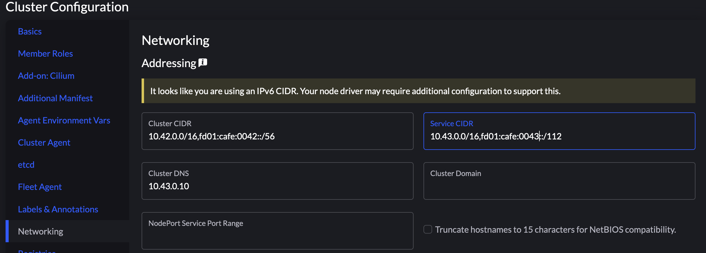

# GCP libvirt KVM

创建 GCP KVM 嵌套虚拟化实例，并在其中启动 libvirt 嵌套虚拟机。

## Usage

```sh
git clone https://github.com/STARRY-S/gcp-libvirt-kvm.git && cd gcp-libvirt-kvm/
```

## Launch GCP instance

创建 GCP KVM 嵌套虚拟化实例。

```sh
vim ./gcp-create-nested.sh # 编辑实例名称，并按需要调整实例 Template 以及启动参数
./gcp-create-nested.sh
```

## Launch libvirt VM

GCP 虚拟机创建成功后，SSH 进入 GCP 虚拟机中，执行脚本安装 libvirt 并启动虚拟机实例。

```sh
git clone https://github.com/STARRY-S/gcp-libvirt-kvm.git && cd gcp-libvirt-kvm/

# 执行脚本在 GCP 实例中安装 libvirt，并创建 KVM 嵌套虚拟机
./prepare-libvirt.sh
```

等待 Libvirt 安装，创建嵌套虚拟机。

脚本执行完成后，创建的虚拟机为：

```console
$ sudo virsh list --all
 Id   Name       State
--------------------------
 1    ubuntu-1   running
 2    ubuntu-2   running
 3    ubuntu-3   running
```

创建的三个虚拟机名称分别为 `ubuntu-1`, `ubuntu-2`, `ubuntu-3`，
可使用 `virsh` 操作这些虚拟机。

```sh
sudo virsh start ubuntu-1       # 启动虚拟机
sudo virsh shutdown ubuntu-1    # 虚拟机关机
```

可通过 IP 地址 SSH 到虚拟机中，三个虚拟机对应的 IPv4 地址为：

```console
$ ssh ubuntu@10.128.0.101
$ ssh ubuntu@10.128.0.102
$ ssh ubuntu@10.128.0.103
```

> [!NOTE]
>
> 默认的用户密码为 `testpassword`。

虚拟机已配置了 IPv6 的 NAT 网络链接，三个虚拟机对应的 IPv6 地址为：

```console
$ ssh ubuntu@fd00:cafe::101
$ ssh ubuntu@fd00:cafe::102
$ ssh ubuntu@fd00:cafe::103
```

> [!NOTE]
>
> 如果 KVM 嵌套虚拟机之间无法通过 IPv6 互相访问，请在 GCP 主机中执行 `sudo ip6tables -P FORWARD ACCEPT`。

### 创建 RKE2 Cilium IPv6 集群

1. 创建 Custom 集群时，选择 RKE2 Cilium，勾选 *Enable IPv6 Support*。

    

1. 编辑 Cilium 的 Helm Config，修改 `cni.exclusive=false` 允许安装第三方 CNI 插件。

    

1. 修改 Networking 配置，设置 ClusterCIDR & ServiceCIDR 的 IPv6 地址。

    

    - ClusterCIDR: `10.42.0.0/16,fd01:cafe:0042::/52`
    - ServiceCIDR: `10.42.0.0/16,fd01:cafe:0043::/112`
    - ClusterDNS: `10.43.0.10`

1. 集群 Pod 会被自动添加 IPv6 IP。

    

# LICENSE

MIT License

Copyright (c) 2024 STARRY-S

Permission is hereby granted, free of charge, to any person obtaining a copy
of this software and associated documentation files (the "Software"), to deal
in the Software without restriction, including without limitation the rights
to use, copy, modify, merge, publish, distribute, sublicense, and/or sell
copies of the Software, and to permit persons to whom the Software is
furnished to do so, subject to the following conditions:

The above copyright notice and this permission notice shall be included in all
copies or substantial portions of the Software.

THE SOFTWARE IS PROVIDED "AS IS", WITHOUT WARRANTY OF ANY KIND, EXPRESS OR
IMPLIED, INCLUDING BUT NOT LIMITED TO THE WARRANTIES OF MERCHANTABILITY,
FITNESS FOR A PARTICULAR PURPOSE AND NONINFRINGEMENT. IN NO EVENT SHALL THE
AUTHORS OR COPYRIGHT HOLDERS BE LIABLE FOR ANY CLAIM, DAMAGES OR OTHER
LIABILITY, WHETHER IN AN ACTION OF CONTRACT, TORT OR OTHERWISE, ARISING FROM,
OUT OF OR IN CONNECTION WITH THE SOFTWARE OR THE USE OR OTHER DEALINGS IN THE
SOFTWARE.
